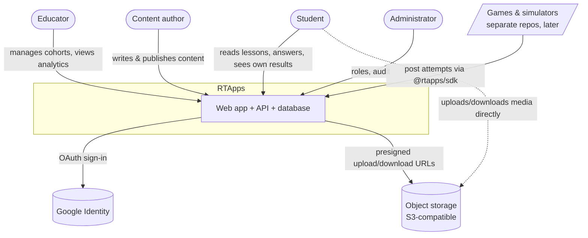
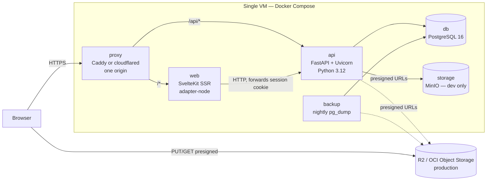
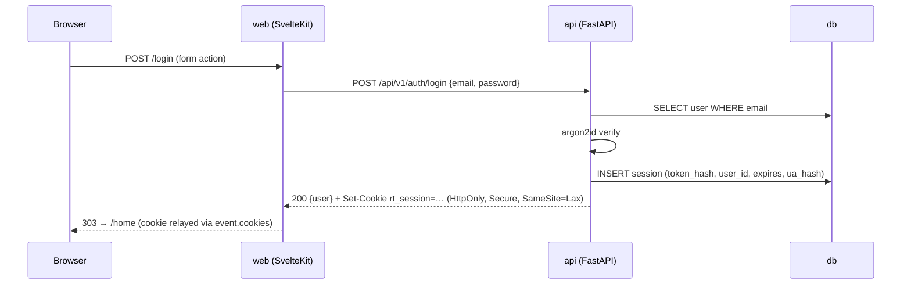
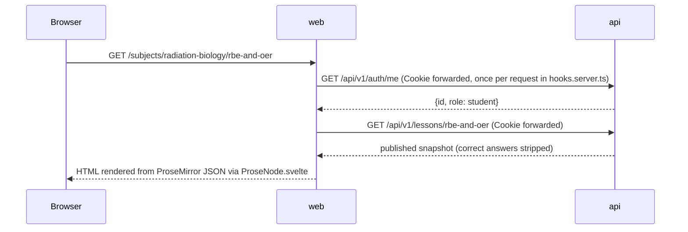
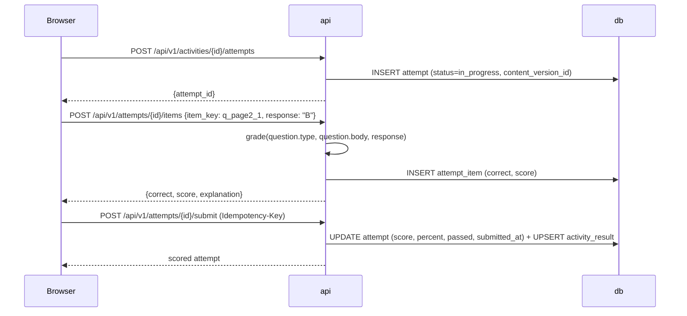
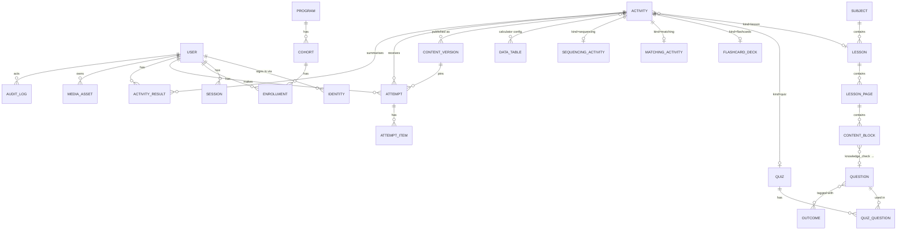
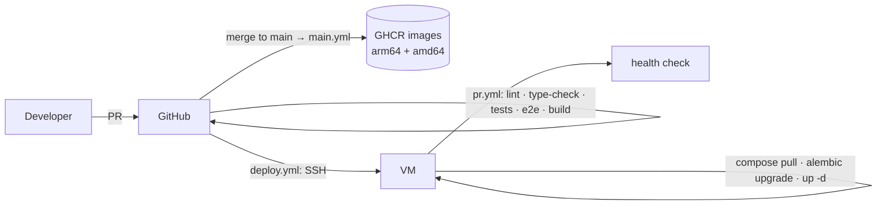

# RTApps — Architecture Design

| | |
|---|---|
| Status | Draft for review (mentor review required before Phase 1 code — see §12) |
| Author | Chris Guzman |
| Date | 2026-08-27 |
| Related | `01-problem-definition-and-scope.md`, `02-requirements.md`, `adr/` |

This document describes how RTApps is built: the services, how they talk to each other, the data model, the API, security, deployment, and testing. It is written to be read top-down by someone who has never seen the code. Decisions with real alternatives are recorded as ADRs and only summarised here.

---

## 1. Overview

RTApps is a web application with three kinds of users:

- **Students** read lessons, answer knowledge checks, take quizzes and practise with flashcards, matching, sequencing, calculators and simulators. Every answer is recorded.
- **Educators** own cohorts of students and see how each student and the cohort as a whole are doing — by subject, by activity, by learning outcome.
- **Authors** (the mentor) write and publish the curriculum inside the application, without touching code.

Everything runs as a small set of containers on one virtual machine. There are two applications: a **web app** (SvelteKit) that renders pages, and an **API** (FastAPI) that owns all data and rules. PostgreSQL stores everything except large files, which live in S3-compatible object storage.

### 1.1 Design principles

1. **The API owns the rules.** Grading, permissions, publishing and analytics live in the API. The web app renders and forwards; it never computes a score or decides who may see what.
2. **One record of truth for results.** Every learning interaction — a knowledge check in a lesson, a quiz, later a game — becomes an `attempt` with per-item detail. Analytics are queries over attempts, not per-feature bookkeeping.
3. **Content is data, not code.** Lessons and activities are rows in the database with a strict schema. Only genuinely programmatic things (calculators' formulas, simulators) are code, and even those are configured by data.
4. **Published content is immutable.** Students always see a published snapshot; authors edit a working copy. A result recorded against version 3 of a lesson still makes sense after version 4 is published.
5. **Boring infrastructure.** Docker Compose on one VM, Postgres, a reverse proxy. Nothing that needs a team to operate.

---

## 2. System context (C4 level 1)



---

## 3. Containers (C4 level 2)



| Service | Technology | Responsibility | Must not |
|---|---|---|---|
| `proxy` | Caddy 2 (automatic TLS) **or** `cloudflared` tunnel + Caddy on plain HTTP | Single public origin; routes `/api/*` to the API and everything else to the web app; compression; security headers | Hold any application logic |
| `web` | SvelteKit (TypeScript), `adapter-node`, TipTap for authoring | Server-side rendering, route guards by role, forms, the lesson/activity renderers, the authoring UI | Access the database; grade anything; decide permissions |
| `api` | FastAPI, Pydantic v2, SQLAlchemy 2 (async), Alembic, Authlib, argon2 | Authentication and sessions; authorization; content model and publishing; grading; attempts and results; analytics; audit log; media presigning; OpenAPI | Render HTML; stream large files |
| `db` | PostgreSQL 16 | All state. JSONB for documents; SQL views for analytics | — |
| `storage` | MinIO (dev) / Cloudflare R2 or OCI Object Storage (prod), S3 API | Media (images, audio), DICOM zips, 3-D models | Be accessed with long-lived credentials from the browser |
| `backup` | Alpine cron container | Nightly `pg_dump` to object storage, 30-day retention | — |

A background worker (queue + Redis) is **deliberately absent** in Release 1: grading is synchronous and takes milliseconds. The API package reserves `app/tasks/` so a worker can be added without restructuring when media processing or nightly roll-ups need it.

---

## 4. Request flows

### 4.1 Same-origin split (ADR-0002)

The proxy puts the API and the web app on **one origin** (`https://app.example`). Consequences:

- The browser sends the session cookie automatically to `/api/v1/...`; there is no CORS configuration and no token juggling in JavaScript.
- SvelteKit `load()` functions run on the server and call the API at `http://api:8000` directly, **forwarding the incoming `Cookie` header**. The page arrives fully rendered.
- Client-side mutations (submitting an answer, editor autosave) call `/api/v1/...` through a generated, typed client.

### 4.2 Login (email + password)



Google sign-in follows the standard OIDC authorization-code flow, implemented in the API with `httpx` and a signed state cookie (no Authlib) (`/auth/google/start` → Google → `/auth/google/callback`); the account is linked by verified email through the `identity` table, and the same session cookie is issued.

### 4.3 Reading a lesson (server-side render)



### 4.4 Answering a knowledge check



The browser never sees a correct answer before it has answered; grading is server-side only.

### 4.5 Educator cohort report

`GET /api/v1/cohorts/{id}/overview` → the API checks that the caller is an educator **enrolled in that cohort with role educator** (in the SQL query, not in the client), writes an `audit_log` row (`actor, action=read_cohort_overview, cohort`), and returns aggregates computed from `activity_result` and `attempt_item`.

### 4.6 Authoring: edit, preview, publish

The `/author` dashboard lists the needs-review queue (activities still carrying migrated-content `import_notes`) plus every subject's activities; `/author/lessons/{id}` is a three-tab editor (Edit/Preview/Publish) over one activity's working copy. Every `/api/v1/authoring/*` route is gated by `require_author` (educator or admin — anyone else gets 403, not 404) at the router level. `PUT .../lessons/{id}/pages` replaces the whole page/block/question tree (delete-then-rebuild, not diffed) — an edit, not a publish: the served student snapshot is unchanged until a separate publish. `GET .../activities/{id}/preview` rebuilds the same stripped snapshot the student route serves, fresh off the working copy, so an author sees an edit before committing to it. `POST .../activities/{id}/publish` validates the working copy (schema, every knowledge check has a correct answer), assembles it into one JSON document, inserts a `content_version` (version n+1, author, change note), clears `import_notes`, and records an audit row; students reading the lesson from that moment receive version n+1, attempts already in progress keep their pinned version. Images go in through a three-step presign flow: `POST media/presign` creates a pending `MediaAsset` row and a presigned PUT URL, the browser uploads directly to storage, then `POST media/{id}/confirm` verifies the object landed and marks it servable; `GET /media/{id}` redirects any signed-in user to a short-lived presigned GET.

---

## 5. Rich-text content (ADR-0003)

Lesson text is authored in **TipTap** (a ProseMirror editor) and stored as **ProseMirror JSON** in JSONB. The document schema is **closed** and defined once, in `packages/schemas/prose-doc.schema.json`:

| Nodes | `doc`, `paragraph`, `heading` (levels 2–4), `bulletList`, `orderedList`, `listItem`, `blockquote`, `table`/`tableRow`/`tableCell`, `image` (by `mediaAssetId`, never a URL), `callout` (`kind` ∈ key-principle / clinical-note / warning), `math` (KaTeX source), `hardBreak` |
|---|---|
| Marks | `bold`, `italic`, `underline`, `link` (https only), `code`, `subscript`, `superscript` |

One schema file drives four things: the TipTap extension list in the editor, the API validator (unknown node or mark → 422), the legacy-migration mapper, and the renderer. The validator (`app/content/prose.py`, `jsonschema`), the mapper (`tools/migrate-legacy`) and the renderer exist as of v0.1.0; the editor (`apps/web/src/lib/author/RichTextEditor.svelte`) shipped in v0.4.0 (plan 3b). It has no math input UI yet, so `math` nodes still render as their KaTeX source in a `<code class="math">`. The renderer, `apps/web/src/lib/prose/ProseNode.svelte`, is a recursive component that switches on node type and emits real Svelte elements. It **never** uses `{@html}`, so there is no HTML-injection surface no matter what an author pastes.

---

## 6. Data model

### 6.1 Entity–relationship diagram



### 6.2 Tables

Conventions: UUID v7 primary keys; `created_at`/`updated_at` on every table; soft-delete only where stated; JSONB columns are validated against a JSON Schema at the API boundary. Status/kind columns are text with CHECK constraints (only `user.role` is a native enum). **Implemented in v0.1.0:** `subject`, `lesson`, `lesson_page`, `content_block` (`rich_text`, `knowledge_check`), `question` (`single_choice`), `activity` (`lesson`), `content_version`, `attempt`, `attempt_item`. **Implemented in v0.2.0:** `cohort` (+ `threshold_percent`), `enrollment`, `activity_result` (+ `latest_percent`), `audit_log` (+ `request_id`). **Implemented in v0.3.0** (plan 3a — quiz/flashcards/matching/sequencing, ADR-0006, program): the seven new tables `quiz`, `quiz_question`, `flashcard_deck`, `matching_activity`, `sequencing_activity`, `outcome`, `question_outcome`; `activity.access` (ADR-0006); `program` (+ `cohort.program_id`, nullable). `program` is a single row today ("Radiation Therapy") with no admin UI yet — a second institution is still a data change, not a migration.

**Identity and cohorts**

| Table | Key columns | Notes |
|---|---|---|
| `user` | `email` (citext, unique), `display_name`, `role` ∈ student/educator/admin, `password_hash` (nullable for Google-only), `deactivated_at` | No date of birth, no student number, no address. Minimal PII by design. |
| `identity` | `user_id`, `provider` (google), `subject`, `email_verified` | Allows several providers per user. |
| `session` | `id` = SHA-256 of the token, `user_id`, `expires_at`, `ua_hash`, `revoked_at` | Raw token exists only in the cookie. |
| `program` | `name` | One row today ("Radiation Therapy"); `cohort.program_id` is nullable so existing cohorts don't need one. No ownership column or admin UI yet — added when a second institution needs one. |
| `cohort` | `program_id`, `name`, `join_code` (unique, rotatable), `starts_on`, `ends_on` | |
| `enrollment` | `user_id`, `cohort_id`, `role` ∈ student/educator, `joined_at`; unique (user, cohort) | An educator "owns" a cohort by being enrolled in it with role educator. |

**Curriculum (working copy)**

| Table | Key columns | Notes |
|---|---|---|
| `subject` | `slug`, `title`, `order`, `summary` | The 13 subjects. |
| `lesson` | `subject_id`, `slug`, `title`, `order`, `status` ∈ draft/published/archived, `current_version_id` | |
| `lesson_page` | `lesson_id`, `order`, `title` | The "Page 3 of 10" unit students navigate. |
| `content_block` | `page_id`, `order`, `type` ∈ rich_text/knowledge_check/media/embed/callout, `body` JSONB | `rich_text` → ProseMirror doc; `knowledge_check` → `{question_id}`; `media` → `{media_asset_id, caption}`; `embed` → `{activity_id}`. |
| `question` | `type` ∈ single_choice/true_false/multi_select/numeric_tolerance/ordering/matching, `stem` JSONB (ProseMirror), `body` JSONB, `explanation` JSONB, `difficulty`, `outcome_ids` uuid[] | `body` shape per type: options + correct index(es); `{value, tolerance, unit}`; ordered items; pairs. Questions are reusable across lessons and quizzes (the legacy workbook has no shared banks; this fixes that). |
| `quiz` | `slug`, `title` | Linked from `activity.ref_id`, not a column here (the existing polymorphic pattern). `pass_percent`, `shuffle` and (when set) `attempts_allowed` live in the paired `activity.config` JSONB, not on this table (v0.3.0 deviation — config-on-activity, below); `attempts_allowed` and `show_explanations` are unused as of v0.3.0. `shuffle` is stored but not honoured yet: `QuizPlayer.svelte` presents questions in snapshot order regardless of the flag, a deliberate v0.3.0 deviation that keeps e2e coverage deterministic (shuffling matters for the assessment phase, where it's tied to attempt integrity, not practice). |
| `quiz_question` | `quiz_id`, `question_id`, `position` | Fixes a bank question's order within one quiz; questions are shared bank rows (`question`, `single_choice` only as of v0.3.0), reusable across quizzes. |
| `flashcard_deck` | `slug`, `title`, `cards` JSONB `[{term, definition}]` | Score tiers (gold/silver/bronze) are not yet implemented; grading is completion-only (§6.3). |
| `matching_activity` | `slug`, `title`, `pairs` JSONB `[{term, definition}]` | `present_n` and `pass_percent` live in `activity.config`, not here; `present_n` is stored but the player presents all pairs as of v0.3.0 — per-attempt sampling arrives with assessment mode. |
| `sequencing_activity` | `slug`, `title`, `items` JSONB (correct order; `[{label, detail?}]`) | `pass_percent` lives in `activity.config`. |
| `data_table` | `key` (e.g. `pdd_6mv`), `title`, `unit`, `grid` JSONB `{row_axis, col_axis, values}` | PDD/TMR/wedge/tray tables; author-editable; referenced by calculators. |
| `activity` | `kind` ∈ lesson/quiz/flashcards/matching/sequencing/calculator/simulator/external, `ref_id`, `title`, `subject_id`, `lesson_id?`, `config` JSONB, `status`, `access` ∈ practice/assessment (default `practice`), `current_version_id` | The polymorphic thing a student "does". `config` also holds the per-kind settings that would otherwise be columns on the type table — `pass_percent`/`shuffle` (quiz), `pass_percent`/`present_n` (matching), `pass_percent` (sequencing) — a deliberate v0.3.0 deviation (§6.3). `calculator`/`simulator` are code-backed: `config` names the implementation (`{code_key: "mu_calc", tables: [...]}`). `external` covers re-hosted legacy tools that post via the SDK. `access` is ADR-0006's assessment gate: `practice` activities (all migrated content) are student-visible; `assessment` pools are 404 to students everywhere until the games phase adds assignments. |
| `outcome` / `question_outcome` | `outcome`: `code` (SLO such as `3.2`), `title`. `question_outcome`: `question_id`, `outcome_id` | Learning outcomes for analytics; tags are on the `question` row (v0.3.0 scope is quiz questions only), not the `activity` row — `activity_outcome`-level tagging is FR-A-14 (3b). |
| `media_asset` | `owner_id`, `storage_key`, `mime`, `bytes`, `sha256`, `width`, `height`, `alt`, `status` ∈ pending/ready | The file itself is in object storage. |

**Publishing**

| Table | Key columns | Notes |
|---|---|---|
| `content_version` | `activity_id`, `version` (unique together, from 1), `snapshot` JSONB, `author_id`, `published_at`, `change_note` | Immutable. Students read `snapshot`; authors edit the working copy. A lesson is versioned through its `activity` row (`kind=lesson`). |

**Results (the integration spine — ADR-0004)**

| Table | Key columns | Notes |
|---|---|---|
| `attempt` | `user_id`, `activity_id`, `content_version_id`, `started_at`, `submitted_at`, `status` ∈ in_progress/submitted/abandoned, `score`, `max_score`, `percent`, `passed`, `duration_s`, `source` ∈ web/sdk, `client_meta` JSONB | One row per try. |
| `attempt_item` | `attempt_id`, `item_key`, `response` JSONB, `correct`, `score`, `max_score`, `time_ms` | One row per question / card / pair. |
| `activity_result` | `user_id`, `activity_id`, `best_percent`, `latest_attempt_id`, `attempts`, `first_passed_at`, `mastery` | Maintained on submit; the row analytics read most. |
| `audit_log` | `actor_id`, `action`, `target_type`, `target_id`, `cohort_id?`, `ip`, `at`, `detail` JSONB | Written for every educator read of student data and every publish. |

### 6.3 Grading

`apps/api/app/grading/` holds one pure function per question type; `single_choice.py` is the only one implemented as of v0.3.0 (`(question.body, response) → GradeResult{correct, score, max_score, feedback}`). `true_false.py`, `multi_select.py`, `numeric_tolerance.py`, `ordering.py` and `matching.py` are deferred: instead of a grader per activity kind, `app.content.activity_snapshots.gradeable_items(snapshot)` re-expresses every kind's answers as per-item single-choice — a lesson knowledge check, a quiz question, a matching pair ("pick the right definition") and a sequencing item ("pick the right position") all reduce to `{key: {body: {options, answer}, explanation}}` and grade through `single_choice.py`. `submit_attempt`/`upsert_activity_result` therefore need no per-kind branch; only flashcards branch specially (completion-only — every score field is null, since a card has no single correct answer to grade). This is a deliberate v0.3.0 architectural simplification, not the original per-type-grader design (FR-S-16); the six dedicated graders remain the plan for when a question type needs partial credit or a shape `gradeable_items` can't express. A lesson attempt's score is the sum over its knowledge checks; a quiz applies `pass_percent` from `activity.config` (§6.2). These functions are the most heavily tested code in the system (property-based tests).

### 6.4 Calculators

The calculator suite (`kind=calculator`, v0.5.0) ships with six implementations: `mu` (photon-dose-to-monitor-units), `inverse_square`, `extended_ssd`, `gap`, `magnification`, and `si_convert` (SI unit conversion). The MU calculator is photon-complete: given dose and a source configuration, it computes **MU = dose / (K · (PDD/100 in SSD mode, or TMR in SAD mode) · Sc · Sp · wedge_factor · tray_factor · inverse_square_factor)**, with an optional Mayneord F correction multiplying the PDD for extended-SSD geometries. The machine-specific factors Sc (collimator), Sp (phantom), and wedge factors are sourced from author-editable single-row `data_table` grids; any missing table degrades gracefully to a factor of 1.0, making incomplete configurations functional in the meantime.

### 6.5 External activities & the arcade

External-kind activities (`kind=external`, v0.6.0) embed browser-based games and educational apps served from `apps/web/arcade/<slug>/` behind session authentication (any signed-in role) via a SvelteKit route with an extension-based allow-map and strict path containment. The student route renders each game as a full-viewport same-origin iframe; the proxy sends `X-Frame-Options: SAMEORIGIN` to prevent clickjacking. The game's only integration with RTApps is through the public shimmed JavaScript interface, `RTApps.reportResult(score)`, which posts a single result message; the player route owns the attempt lifecycle (create, submit, finalize). On submit, the server clamps the reported score against the pinned content version's `max_score`; `percent` is computed as (score / max_score × 100), and `passed` remains null since external activities are practice, not assessment.

**v0.7.0 expansion:** the arcade library now holds 23 games — 22 added across five audited batches in v0.7.0 plus Cell Defender from v0.6.0 — each integrated via a two-line shim recipe: copy the game to `arcade/<slug>/`, include the shim script in its entry page, and wire one terminal-event `RTApps.reportResult` (or `reportCompletion`) call at the game's true end state. Scored games carry audited `max_score` derivations in their published `activity.config`, clamped server-side on submit. Two unscored games — Beam Sculptor and OncoLife UNO — use a completion-only contract (a config flag, empty-body submit, "Completed" rendering) instead of a score. Educators now see per-attempt score rows for external activities (issue #53), and a CI test pins the dev and prod Caddyfiles' security headers to each other (issue #56).

### 6.6 The simulator world

v0.8.0 adds a walkable simulator world alongside the arcade library: a hub ("Radiation Oncology Center", `arcade_slug` `sim-hub`) with a door that hands off to a combined LINAC/CT room app (`arcade_slug` `linac-ct`), both served through the same authed `/arcade` route as the §6.5 games. The hub's QA walkthrough is scored (`sim-hub-qa`, max score 4); the room app's LINAC fraction (`sim-linac-fraction`) and CT scan (`sim-ct-scan`) are completion-only, matching the completion-only contract already used by unscored games in §6.5.

The room app is the first consumer of a second integration tier, alongside the §6.5 shim. The shim suits an *embedded* game that posts one `RTApps.reportResult` at its terminal event inside the player's iframe; the simulator world's apps are standalone API clients that may record many attempts in one session (walking through a door re-enters a scene), so they call the API directly through `apps/web/static/arcade/rtapps-sdk.js`: `RTApps.recordResult(slug, opts?)` resolves the slug, starts an attempt, and submits — one attempt per event — retrying each step individually and reusing the same `Idempotency-Key` across a submit retry for exactly-once delivery; scored activities require a numeric score. `RTApps.activityUrl(slug)` gives the SDK the same door-navigation address a game needs to link elsewhere in the world. Resolution is by a new `sdk_slug` config key on `external`-kind activities, read through `GET /api/v1/activities/by-sdk-slug/{slug}` → `{activity_id, subject_slug, completion_only, max_score}`, matching only published, practice-access external activities and returning the first match.

The room app's five embedded assets — originally inlined as ~1 MB base64 PNGs apiece — were extracted to `/arcade/linac-ct/assets/`, cutting the page from 25.88 MB to 1.40 MB; a `<base href="/arcade/linac-ct/">` tag was injected so the extracted references still resolve inside the blob-iframe suite the arcade route uses. Arcade image, audio, and font assets now carry `Cache-Control: private, max-age=3600`; everything else — HTML, JS, CSS, JSON — remains `no-cache` so a republished app is never served stale.

v0.9.0 adds three LINAC alignment sets to the Games shelf (`three-point-setup`, `linac-training-beginner`, `linac-training-intermediate`), completion-only via the §6.5 shim; the sandbox anchors completion to alignment success, the two training menus to last-module completion. The console emulator becomes a second simulator-hub door — `arcade_slug` `linac-console`, `sdk_slug` `sim-console`, completion-only via the direct SDK — placed at the hub's Learning Commons / Staff Education room behind a parallel `CONSOLE_APP_URL` prefetch gate with the same legacy fallback as the room door's `ROOM_APP_URL`; dead audio references were stripped and a back-link to the hub added. The hub's QA verdict buttons now latch — one verdict per scenario — re-arming on every new QA launch and on lab reset (#73).

---

## 7. API

Base path `/api/v1`. Resources are plural nouns; the API is documented by FastAPI's OpenAPI and that document is the contract for the front end. ✅ marks endpoints implemented as of v0.3.0; `packages/api-client` is generated from `openapi.json` and the `contract` CI job fails when it is stale.

| Group | Endpoints | Who |
|---|---|---|
| auth | `POST auth/register`, `POST auth/login`, `POST auth/logout`, `GET auth/me`, `GET auth/providers`, `GET auth/google/start`, `GET auth/google/callback`, `POST auth/password-reset/{request,confirm}`, `POST auth/change-password` ✅ | anyone / signed-in |
| cohorts | `POST cohorts` ✅, `GET cohorts` ✅, `GET cohorts/{id}` ✅, `PATCH cohorts/{id}` ✅, `POST cohorts/{id}/rotate-code` ✅, `POST cohorts/join {code}` ✅, `GET cohorts/{id}/members` ✅, `DELETE cohorts/{id}/members/{uid}` ✅ | educator (own), student (join) |
| content (published) | `GET subjects` ✅, `GET subjects/{slug}` ✅, `GET lessons/{slug}` ✅, `GET activities/{id}` ✅ — returns the published snapshot with correct answers stripped; 404 to students for `access = assessment` (ADR-0006), `GET activities/by-sdk-slug/{slug}` ✅ — resolves an external activity's `sdk_slug` for the arcade SDK (§6.6, v0.8.0) | signed-in |
| attempts | `POST activities/{id}/attempts` ✅, `POST attempts/{id}/items` ✅, `POST attempts/{id}/submit` ✅ (requires `Idempotency-Key`), `GET me/results` ✅, `GET me/attempts/{id}` | owner of the attempt |
| analytics | `GET cohorts/{id}/overview` ✅, `GET cohorts/{id}/students/{uid}` ✅, `GET cohorts/{id}/activities/{aid}` ✅, `GET cohorts/{id}/outcomes` ✅ (v0.3.0 deviation: quiz items only — §7 note below), `GET cohorts/{id}/overview.csv` ✅, `GET cohorts/{id}/activities/{aid}.csv` ✅, `GET cohorts/{id}/outcomes.csv` ✅ — each read audited | educator (own cohort), admin |
| authoring | `POST/PATCH lessons`, `PUT lessons/{id}/pages` (whole tree), `POST/PATCH questions`, `POST/PATCH activities`, `POST/PATCH data-tables`, `POST lessons|activities/{id}/publish`, `GET …/versions`, `POST …/versions/{n}/restore`, `POST media/presign`, `POST media/{id}/confirm` | educator, admin |
| admin | `GET admin/users` ✅, `PATCH admin/users/{id}/role` ✅, `POST admin/users/{id}/deactivate` ✅, `POST admin/users/{id}/erase` ✅, `GET admin/audit-log` ✅, `POST admin/users/{id}/reset-password` ✅ | admin |
| system | `GET health`, `GET openapi.json` | public |

Outcome mastery (`GET cohorts/{id}/outcomes`, FR-E-07) is a v0.3.0 deviation from the original scope: `question_outcome` tags questions, and quiz `attempt_item.item_key` is the question id, so only quiz items roll up into outcome percentages — a lesson knowledge check's `item_key` is a content-block key, not a question id, so lesson items (and flashcards/matching/sequencing, untagged as of v0.3.0) don't appear in this view. Documented limitation, not a bug; broader outcome tagging (FR-A-14) is 3b.

Conventions:

- **Authorization** is a FastAPI dependency (`require_role`, `require_cohort_educator`) and cohort ownership is enforced inside the query, never by trusting client-supplied ids.
- **Pagination**: cursor-based, `?cursor=&limit=` → `{items, next_cursor}`.
- **Errors**: RFC 9457 `application/problem+json` — `{type, title, status, detail, errors[]}`; Pydantic validation errors map to `errors[]`.
- **Idempotency**: `submit` and SDK posts accept `Idempotency-Key`; a repeated key returns the original result.
- **Versioning**: URL prefix; only additive changes within `v1`.
- **Typed client**: CI exports `openapi.json` and regenerates `packages/api-client` (`openapi-typescript` + `openapi-fetch`); the build fails if the committed client is stale, so front end and API cannot drift silently.

---

## 8. Security and privacy

| Concern | Measure |
|---|---|
| Passwords | argon2id (`argon2-cffi`), per-user salt, parameters tuned to ~250 ms on the target VM |
| Sessions | Opaque 256-bit random token; only its SHA-256 stored; cookie `rt_session` `HttpOnly; Secure; SameSite=Lax; Path=/`; 14-day sliding expiry; revocation on logout and password change |
| CSRF | `SameSite=Lax` plus an `Origin`/`Referer` allow-list check on every non-GET request in the API |
| XSS | Rich text rendered from JSON by components — no `{@html}`, no sanitiser to get wrong; strict CSP (`default-src 'self'`, images from the storage origin only) |
| Transport | HTTPS only (Caddy auto-TLS or Cloudflare); HSTS |
| Secrets | Runtime secrets only in `/opt/rtapps/.env` on the VM (mode 600); CI has no database credentials; GitHub push protection on the org |
| Student data | Minimal PII (name, email, cohort membership); educators see only cohorts they are enrolled in; every educator read of student data is audit-logged; admin can deactivate and **erase** a user (attempts anonymised, PII nulled) |
| Patient data | All patient records in the EMR content are fictional; the system stores no real PHI and is not a medical device |
| Files | Browser uploads/downloads go straight to object storage with short-lived presigned URLs; the API validates MIME/size on `confirm` |
| Dependencies | Dependabot on uv, pnpm and Actions; `pip-audit`/`pnpm audit` in CI |
| Rate limiting | `login`, `register`, password-reset and `join` are rate-limited per IP at the API (NFR-13); see docs/06-operations.md §11 for a known caveat about trusting the proxy as the only path in |
| Error tracking | `sentry_sdk` in the API reports unhandled exceptions when `SENTRY_DSN` is set (NFR-23). v0.3.0 deviation: web only wires Sentry server-side, in `hooks.server.ts` — no browser-side `@sentry/sveltekit` instrumentation yet, so a client-only JS error (as opposed to a `load`/action failure) is not reported. |
| Cross-origin clients (Phase 4) | `SameSite=Lax` cookies are not sent to a games site on another origin. Before the SDK ships, decide between hosting games under the same parent domain with a `Domain=` cookie, or issuing short-lived bearer tokens to the SDK (ADR-0002 follow-up). Not needed for Release 1, where every page is same-origin. |

---

## 9. Repository layout

```
rtapps/
  apps/
    web/                    SvelteKit (TypeScript)
      src/routes/(student)/ (educator)/ (author)/ (admin)/   route groups = role guards
      src/lib/prose/ProseNode.svelte                          JSON → elements renderer
      src/lib/activities/   Lesson, Quiz, Flashcards, Matching, Sequencing, Calculator components
      src/hooks.server.ts   resolves locals.user once per request; guards
    api/                    FastAPI
      app/{auth,content,authoring,attempts,grading,analytics,media,audit}/
      app/tasks/            reserved for a future worker
      alembic/              migrations
      tests/                pytest
  packages/
    schemas/                prose-doc, question bodies, attempt payload (JSON Schema → TS types + Pydantic models)
    api-client/             generated from openapi.json — never edited by hand
    sdk/                    @rtapps/sdk: start() / item() / submit(), offline queue (Phase 4)
  tools/
    migrate-legacy/         Python: legacy HTML → API drafts, with a per-page report
  infra/
    compose.yaml            development
    compose.prod.yaml       production (GHCR images, volumes, backup)
    Caddyfile, cloudflared/ proxy variants
    .env.example, backup.sh
  .github/workflows/        pr.yml, main.yml, deploy.yml
  docs/                     this folder
  Makefile, pnpm-workspace.yaml
```

---

## 10. Environments and deployment (ADR-0005)

### 10.1 Development

`make dev` → `docker compose up --build` brings up `db`, `storage` (MinIO with a bucket-init job), `api` (Uvicorn with reload, source bind-mounted, runs `alembic upgrade head` on start), `web` (Vite dev server with HMR), `proxy` (Caddy on `http://localhost:8080`, same routing rules as production) and `mailpit` (catches auth e-mails). `make seed` loads an admin, an educator, one cohort, one subject with a published lesson and quiz, and ten fake students with attempts. `.env` is copied from `.env.example`; only `SESSION_SECRET` and Google OAuth keys differ per machine.

### 10.2 Test and production

Runbook: `docs/06-operations.md` (provision, `.env`, ingress, GitHub Environment secrets, deploy, verify, backup/restore, rollback). Implemented in v0.2.0: `infra/compose.prod.yaml` (+ `compose.tunnel.yaml`), `Caddyfile.prod`, the `backup` container, `main.yml` and `deploy.yml`.

Same `compose.prod.yaml`, different `.env` and different VM. Images are pulled from GHCR by commit SHA; no bind mounts; `web` runs the `adapter-node` build; Postgres data is on a block volume; the `backup` container runs `pg_dump` nightly to object storage with 30-day retention (media buckets have versioning enabled). Migrations run as a **one-shot step in the deploy workflow**, not on container start, so a bad migration never loops a restarting container.



Target hosting is an Oracle Cloud ARM VM (free tier: 4 OCPU / 24 GB) behind Cloudflare (DNS, TLS or Tunnel, R2 for objects). Nothing in the design depends on that choice: any Ubuntu VM with Docker and any S3-compatible bucket works.

### 10.3 Scaling path

Single VM is expected to serve a program of a few hundred students comfortably. If it doesn't: (1) move Postgres to a managed instance, (2) run two `api` replicas behind the proxy, (3) add the worker for media/analytics. None of these change application code.

---

## 11. Testing strategy

| Layer | Tooling | What is tested |
|---|---|---|
| Grading functions | pytest + hypothesis | Every question type; tolerance boundaries; partial credit; malformed responses |
| API | pytest + httpx against a real Postgres (transaction rolled back per test) | Auth flows; the permission matrix (student cannot read another cohort; educator cannot read a cohort they're not in); attempt lifecycle; publish/version pinning; audit rows written |
| Shared schemas | JSON fixture files (valid + invalid) run by both Python and TypeScript tests | ProseMirror documents, question bodies, attempt payloads |
| Web units | vitest + @testing-library/svelte | `ProseNode` renders every node type and rejects unknown ones; activity components emit the right response shapes |
| End-to-end | Playwright against the compose stack | register → join cohort → open lesson → answer → see score → educator sees it; educator fixes a needs-review lesson (edit → preview → publish, with an image upload) → student sees the published edit; student computes MU from the seeded calculator |
| Migration tool | pytest golden files | Three legacy pages → expected JSON |
| Contract | CI job | `openapi.json` → regenerated client must match the committed one |

CI (`pr.yml`) runs all of the above on every pull request (jobs `api`, `web`, `tools`, `contract`, `images`, `e2e`) and is a required check on `main`. Coverage gate: 70 % on `app/grading` and `app/auth`, enforced on full-suite runs (CI and `make test-api`), rising as the codebase grows.

---

## 12. Review and next steps

- **Mentor review of this document** is the gate before Phase 1 code. Questions for that review are in `01-problem-definition-and-scope.md` §8; the design questions specifically: (a) are the seven content types and their rules (80 % pass, badge tiers, attempts allowed) right? (b) is "educator = enrolled in cohort with role educator" the right ownership model? (c) which learning-outcome codes should analytics use (ARRT content specifications, programme SLOs, both)?
- Phase 1 implementation plan follows approval: scaffold, auth, one migrated lesson with knowledge checks, tests, CI — milestone M1.
- Decisions recorded in `docs/adr/`: 0001 stack, 0002 sessions/proxy, 0003 content storage, 0004 result schema, 0005 deployment.
